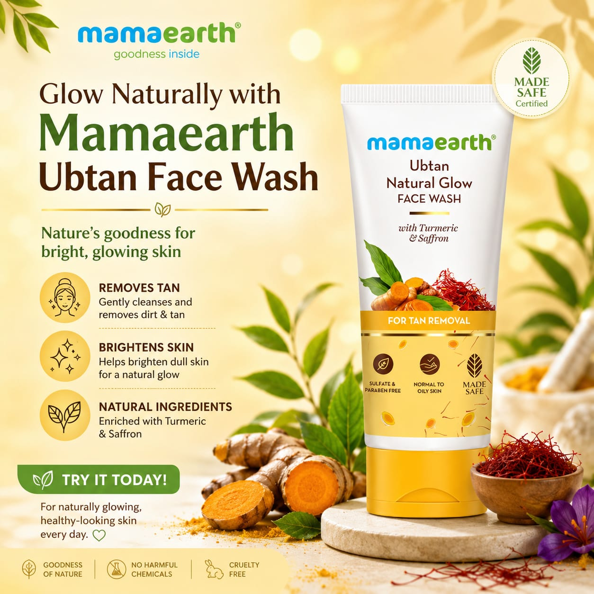
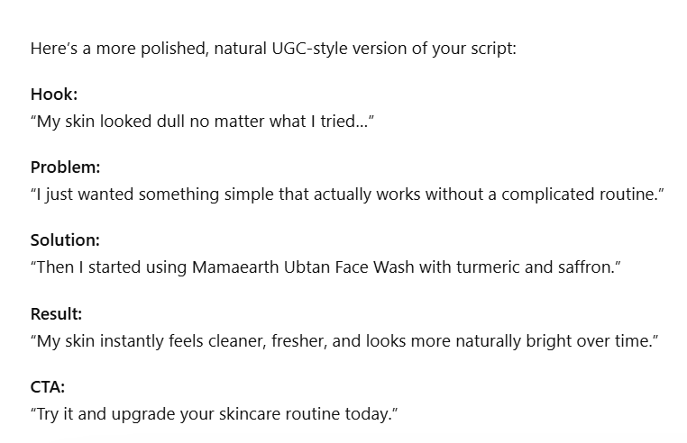

# AI-Powered UGC Ad Content Pack

## Project Overview

This project was created as part of the **Future Interns Prompt Engineering Internship**.

The objective of this project is to use AI tools such as ChatGPT to generate high-converting **UGC (User-Generated Content) style advertisements** for social media marketing.

---

## Product Chosen

**Mamaearth Ubtan Face Wash**

A popular skincare product known for helping remove tan, cleanse the skin, and provide a natural glow.

---

## Features

* UGC-style Ad Hooks
* Instagram Ad Copy
* Facebook Ad Copy
* YouTube Shorts Script
* CTA-Focused Content
* AI-Generated Captions
* Reusable Prompt Templates

---

## Tools Used

* ChatGPT
* GitHub
* Canva

---

## Project Structure

```text
FUTURE_PE_02/

├── prompts/
│   ├── hooks_prompt.txt
│   ├── instagram_ad_prompt.txt
│   ├── facebook_ad_prompt.txt
│   ├── youtube_shorts_prompt.txt
│   └── cta_prompt.txt
│
├── outputs/
│   ├── hooks_output.txt
│   ├── instagram_ad.txt
│   ├── facebook_ad.txt
│   ├── youtube_shorts_script.txt
│   └── cta_output.txt
│
├── visuals/
│   ├── prompt_hooks.png
│   ├── prompt_ugc.png
│   ├── prompt_cta.png
│   ├── hooks_output.png
│   ├── instagram_ad_output.png
│   ├── repository_structure.png
│   └── mamaearth_poster.jpeg
│
└── README.md
```

---

## Learning Outcomes

* Improved Prompt Engineering Skills
* Learned UGC Ad Content Creation
* Understood AI-Powered Marketing Workflows
* Practiced Creating Platform-Specific Ad Scripts
* Enhanced Content Writing Skills

---

## Platforms Covered

* Instagram Reels
* Facebook Ads
* YouTube Shorts

---

## Product Poster



---

## Sample Instagram Ad

✨ Tired of dull and tanned skin?

Say hello to **Mamaearth Ubtan Face Wash**! 🌿

Infused with the goodness of Turmeric and Saffron, it gently removes tan, cleanses deeply, and leaves your skin glowing naturally.

✅ Removes Tan
✅ Brightens Skin
✅ Suitable for All Skin Types

Get ready to reveal your natural glow every day! ✨

#Mamaearth #UbtanFaceWash #SkincareRoutine #GlowingSkin #NaturalSkincare

---

## Instagram Ad Output



---

## Outcome

This project demonstrates how prompt engineering and AI tools can be used to create engaging UGC-style marketing content for skincare products. Through this task, I learned how to generate platform-specific advertisements, compelling hooks, and effective call-to-action content using AI, making digital marketing more creative and efficient.

---

## Author

Submitted as part of the **Future Interns Prompt Engineering Internship Program**.
